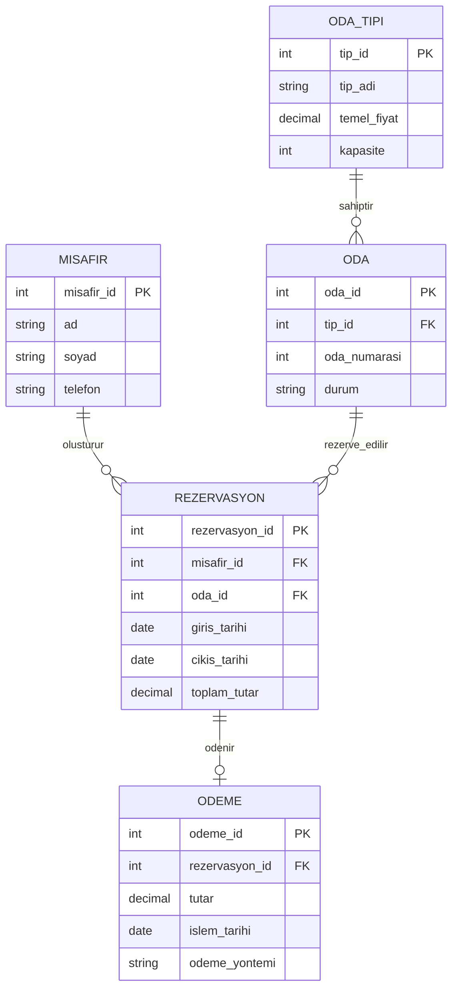

```mermaid
erDiagram
    MISAFIR {
        int misafir_id PK
        string ad
        string soyad
        string telefon
    }
    
    ODA_TIPI {
        int tip_id PK
        string tip_adi
        decimal temel_fiyat
        int kapasite
    }
    
    ODA {
        int oda_id PK
        int tip_id FK
        int oda_numarasi
        string durum
    }
    
    REZERVASYON {
        int rezervasyon_id PK
        int misafir_id FK
        int oda_id FK
        date giris_tarihi
        date cikis_tarihi
        decimal toplam_tutar
    }
    
    ODEME {
        int odeme_id PK
        int rezervasyon_id FK
        decimal tutar
        date islem_tarihi
        string odeme_yontemi
    }

    ODA_TIPI ||--o{ ODA : "sahiptir"
    MISAFIR ||--o{ REZERVASYON : "olusturur"
    ODA ||--o{ REZERVASYON : "rezerve_edilir"
    REZERVASYON ||--o| ODEME : "odenir"
```

