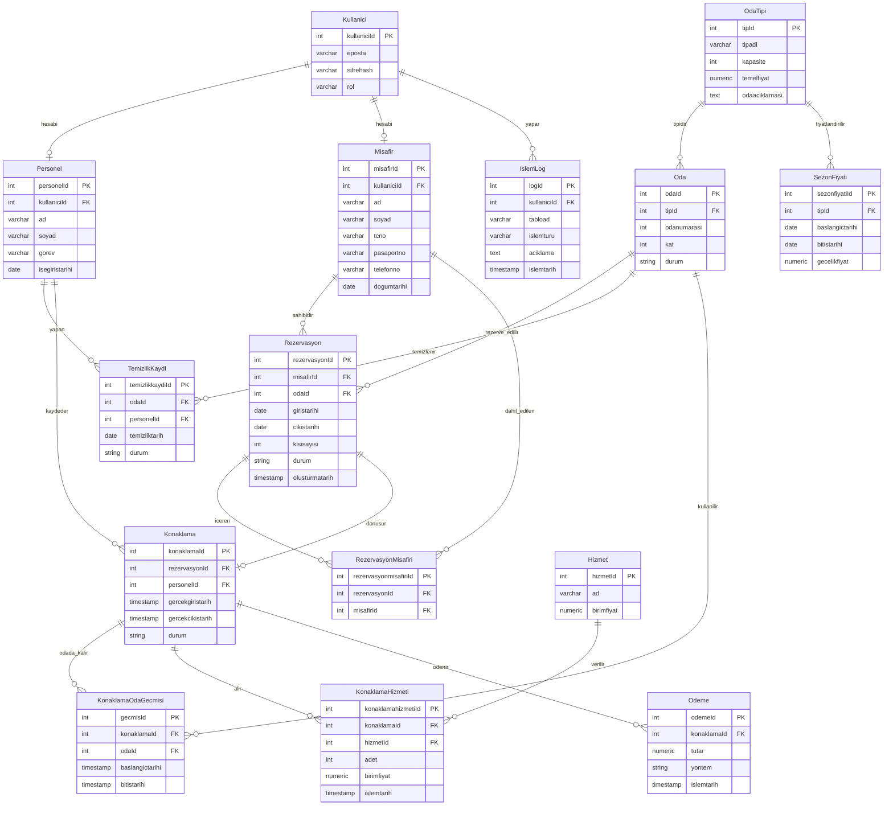

```mermaid
erDiagram
    Kullanici {
        int kullaniciId PK
        varchar eposta
        varchar sifrehash
        varchar rol
    }
    Personel {
        int personelId PK
        int kullaniciId FK
        varchar ad
        varchar soyad
        varchar gorev
        date isegiristarihi
    }
    Misafir {
        int misafirId PK
        int kullaniciId FK
        varchar ad
        varchar soyad
        varchar tcno
        varchar pasaportno
        varchar telefonno
        date dogumtarihi
    }
    OdaTipi {
        int tipId PK
        varchar tipadi
        int kapasite
        numeric temelfiyat
        text odaaciklamasi
    }
    Oda {
        int odaId PK
        int tipId FK
        int odanumarasi
        int kat
        string durum
    }
    SezonFiyati {
        int sezonfiyatiId PK
        int tipId FK
        date baslangictarihi
        date bitistarihi
        numeric gecelikfiyat
    }
    IslemLog {
        int logId PK
        int kullaniciId FK
        varchar tabload
        varchar islemturu
        text aciklama
        timestamp islemtarih
    }
    Rezervasyon {
        int rezervasyonId PK
        int misafirId FK
        int odaId FK
        date giristarihi
        date cikistarihi
        int kisisayisi
        string durum
        timestamp olusturmatarih
    }
    RezervasyonMisafiri {
        int rezervasyonmisafiriId PK
        int rezervasyonId FK
        int misafirId FK
    }
    TemizlikKaydi {
        int temizlikkaydiId PK
        int odaId FK
        int personelId FK
        date temizliktarih
        string durum
    }
    Konaklama {
        int konaklamaId PK
        int rezervasyonId FK
        int personelId FK
        timestamp gercekgiristarih
        timestamp gercekcikistarih
        string durum
    }
    KonaklamaOdaGecmisi {
        int gecmisId PK
        int konaklamaId FK
        int odaId FK
        timestamp baslangictarihi
        timestamp bitistarihi
    }
    Hizmet {
        int hizmetId PK
        varchar ad
        numeric birimfiyat
    }
    KonaklamaHizmeti {
        int konaklamahizmetiId PK
        int konaklamaId FK
        int hizmetId FK
        int adet
        numeric birimfiyat
        timestamp islemtarih
    }
    Odeme {
        int odemeId PK
        int konaklamaId FK
        numeric tutar
        string yontem
        timestamp islemtarih
    }

    Kullanici ||--o| Personel : "hesabi"
    Kullanici ||--o| Misafir : "hesabi"
    Kullanici ||--o{ IslemLog : "yapar"
    OdaTipi ||--o{ Oda : "tipidir"
    OdaTipi ||--o{ SezonFiyati : "fiyatlandirilir"
    Misafir ||--o{ Rezervasyon : "sahibidir"
    Oda ||--o{ Rezervasyon : "rezerve_edilir"
    Rezervasyon ||--o{ RezervasyonMisafiri : "iceren"
    Misafir ||--o{ RezervasyonMisafiri : "dahil_edilen"
    Oda ||--o{ TemizlikKaydi : "temizlenir"
    Personel ||--o{ TemizlikKaydi : "yapan"
    Rezervasyon ||--o| Konaklama : "donusur"
    Personel ||--o{ Konaklama : "kaydeder"
    Konaklama ||--o{ KonaklamaOdaGecmisi : "odada_kalir"
    Oda ||--o{ KonaklamaOdaGecmisi : "kullanilir"
    Konaklama ||--o{ KonaklamaHizmeti : "alir"
    Hizmet ||--o{ KonaklamaHizmeti : "verilir"
    Konaklama ||--o{ Odeme : "odenir"
```

