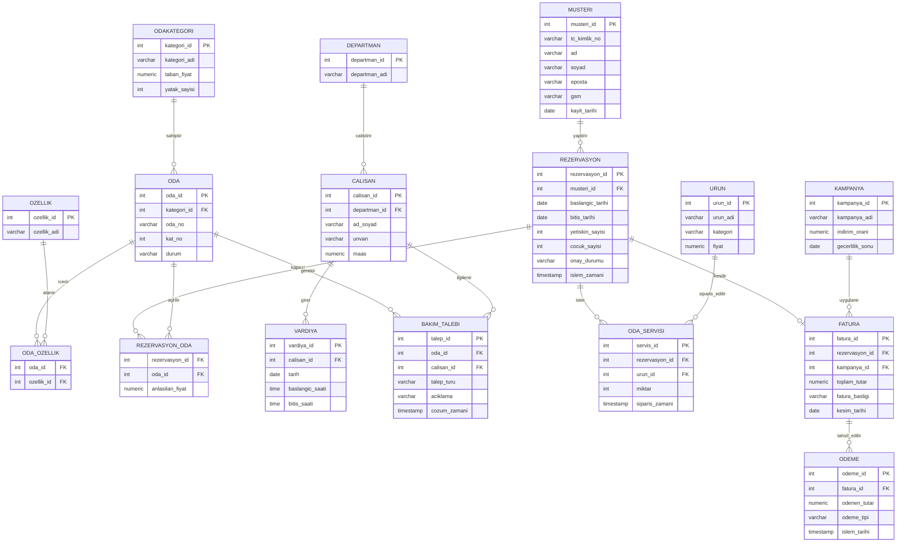

```mermaid
erDiagram
    MUSTERI {
        int musteri_id PK
        varchar tc_kimlik_no
        varchar ad
        varchar soyad
        varchar eposta
        varchar gsm
        date kayit_tarihi
    }
    ODAKATEGORI {
        int kategori_id PK
        varchar kategori_adi
        numeric taban_fiyat
        int yatak_sayisi
    }
    ODA {
        int oda_id PK
        int kategori_id FK
        varchar oda_no
        int kat_no
        varchar durum
    }
    OZELLIK {
        int ozellik_id PK
        varchar ozellik_adi
    }
    ODA_OZELLIK {
        int oda_id FK
        int ozellik_id FK
    }
    REZERVASYON {
        int rezervasyon_id PK
        int musteri_id FK
        date baslangic_tarihi
        date bitis_tarihi
        int yetiskin_sayisi
        int cocuk_sayisi
        varchar onay_durumu
        timestamp islem_zamani
    }
    REZERVASYON_ODA {
        int rezervasyon_id FK
        int oda_id FK
        numeric anlasilan_fiyat
    }
    DEPARTMAN {
        int departman_id PK
        varchar departman_adi
    }
    CALISAN {
        int calisan_id PK
        int departman_id FK
        varchar ad_soyad
        varchar unvan
        numeric maas
    }
    VARDIYA {
        int vardiya_id PK
        int calisan_id FK
        date tarih
        time baslangic_saati
        time bitis_saati
    }
    BAKIM_TALEBI {
        int talep_id PK
        int oda_id FK
        int calisan_id FK
        varchar talep_turu
        varchar aciklama
        timestamp cozum_zamani
    }
    URUN {
        int urun_id PK
        varchar urun_adi
        varchar kategori
        numeric fiyat
    }
    ODA_SERVISI {
        int servis_id PK
        int rezervasyon_id FK
        int urun_id FK
        int miktar
        timestamp siparis_zamani
    }
    KAMPANYA {
        int kampanya_id PK
        varchar kampanya_adi
        numeric indirim_orani
        date gecerlilik_sonu
    }
    FATURA {
        int fatura_id PK
        int rezervasyon_id FK
        int kampanya_id FK
        numeric toplam_tutar
        varchar fatura_basligi
        date kesim_tarihi
    }
    ODEME {
        int odeme_id PK
        int fatura_id FK
        numeric odenen_tutar
        varchar odeme_tipi
        timestamp islem_tarihi
    }

    ODAKATEGORI ||--o{ ODA : "sahiptir"
    ODA ||--o{ ODA_OZELLIK : "icerir"
    OZELLIK ||--o{ ODA_OZELLIK : "atanir"
    MUSTERI ||--o{ REZERVASYON : "yaptirir"
    REZERVASYON ||--o{ REZERVASYON_ODA : "kapsar"
    ODA ||--o{ REZERVASYON_ODA : "ayrilir"
    DEPARTMAN ||--o{ CALISAN : "calistirir"
    CALISAN ||--o{ VARDIYA : "girer"
    ODA ||--o{ BAKIM_TALEBI : "gerekir"
    CALISAN ||--o{ BAKIM_TALEBI : "ilgilenir"
    REZERVASYON ||--o{ ODA_SERVISI : "ister"
    URUN ||--o{ ODA_SERVISI : "siparis_edilir"
    REZERVASYON ||--o| FATURA : "kesilir"
    KAMPANYA ||--o{ FATURA : "uygulanir"
    FATURA ||--o{ ODEME : "tahsil_edilir"
```

